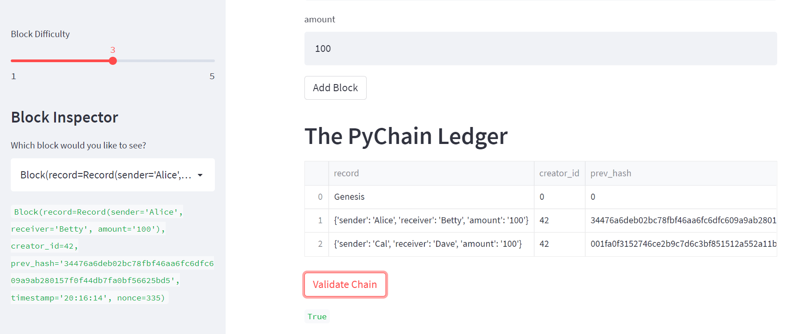

# 18_blockchain_ledger

Build a blockchain-based ledger system in Python. Create blocks, a chain, and validation function

---

## Technologies  
Uses Python 3.10.4.  
Libraries    
  *streamlit  
  *dataclasses  
  *typing  
  *datetime  
  *pandas  
  *hashlib

---  

## Installation Guide  
1. Download this repo.  
2. Install streamlit `pip install streamlit` if you don't already have it.  
3. Open a terminal and navigate to 18_blockchain_ledger dir.
4. Run `streamlit run pychain.py`  

---  

## Usage  
Enter data into the provided fields to add blocks to the chain. Utilize the block explorer sidebar to examine individual blocks. Utilize the Verify function to trigger an audit of the entire chain. 

---  

## Verification  
  

---  

## Contributors  
Base code provided as class materials but skillfully updated by Morgan Blackmore.  

---  

## License  
Code provided under [MIT](https://mit-license.org/) license.

