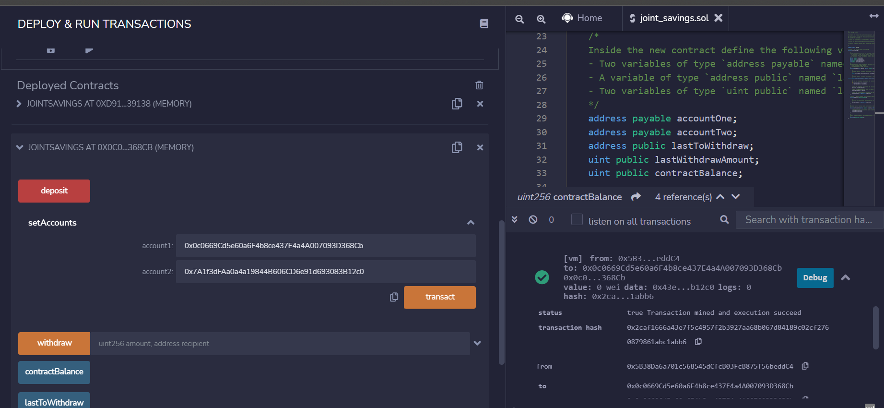
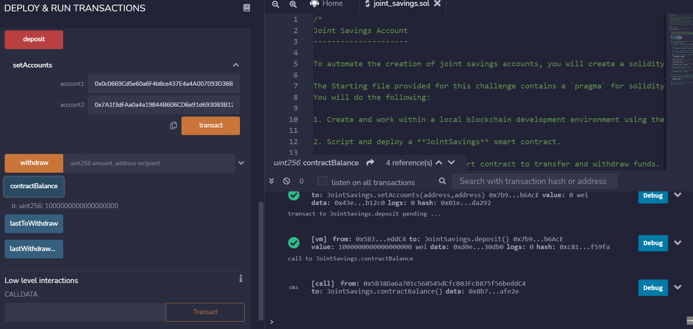
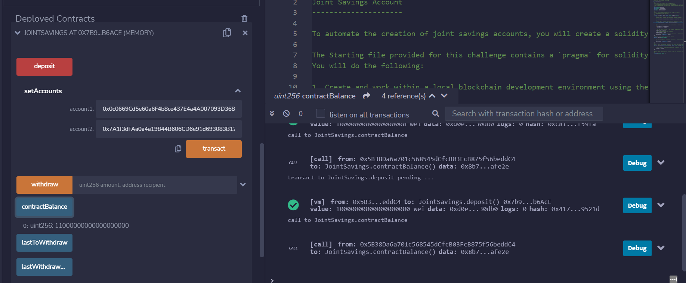
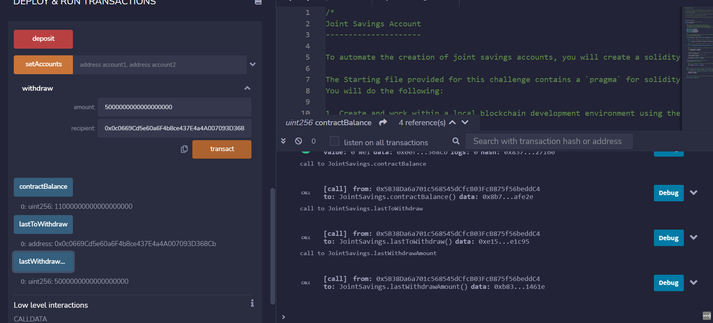
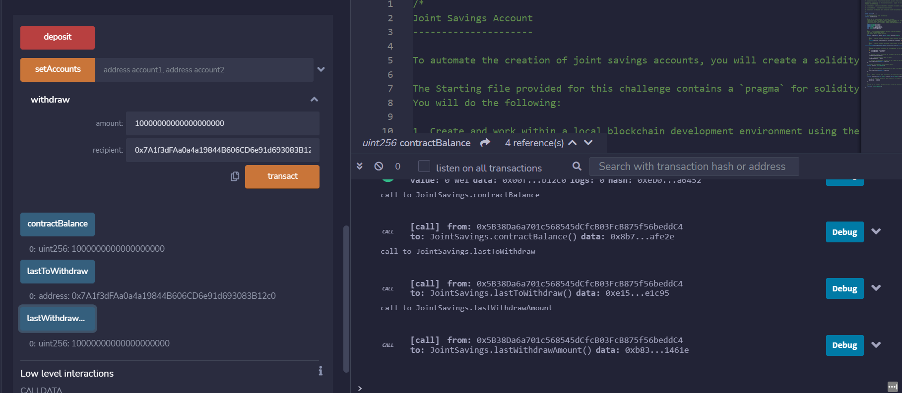

# 20_smart_contracts_solidity
Create smart contract with Solidity using Remix IDE, deploy and test

---

## Technologies  
Uses Solidity, Remix IDE

---  

## Testing

### Set Accounts  
  
  
### Deposit 1 Eth of Wei  
  
  
### Deposit 10 Eth of Wei  
  
  
### Deposit 5 Eth of Wei  
  
  
### Withdraw 5 Eth into AccountOne  
  
  
### Withdraw 10 Eth into AccountTwo  
  

---  

## Contributors  
Base code provided as class materials but skillfully updated by Morgan Blackmore.  

---  

## License  
Code provided under [MIT](https://mit-license.org/) license.
